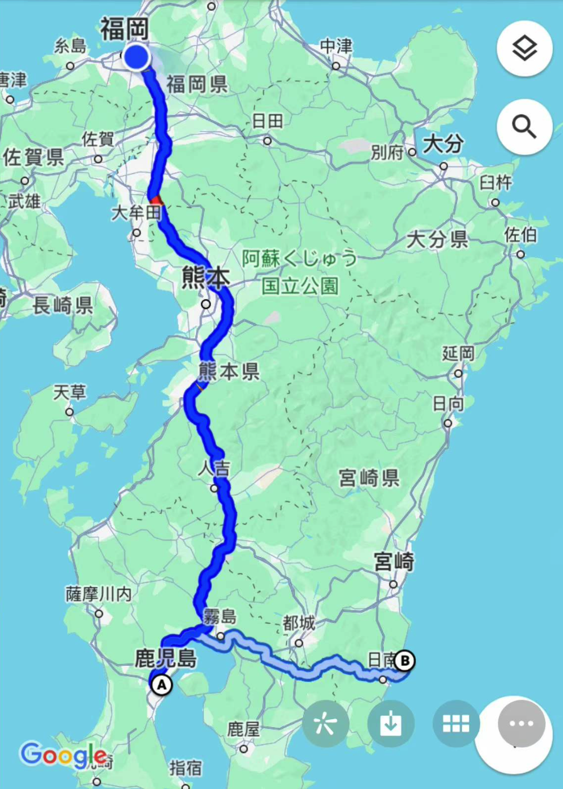
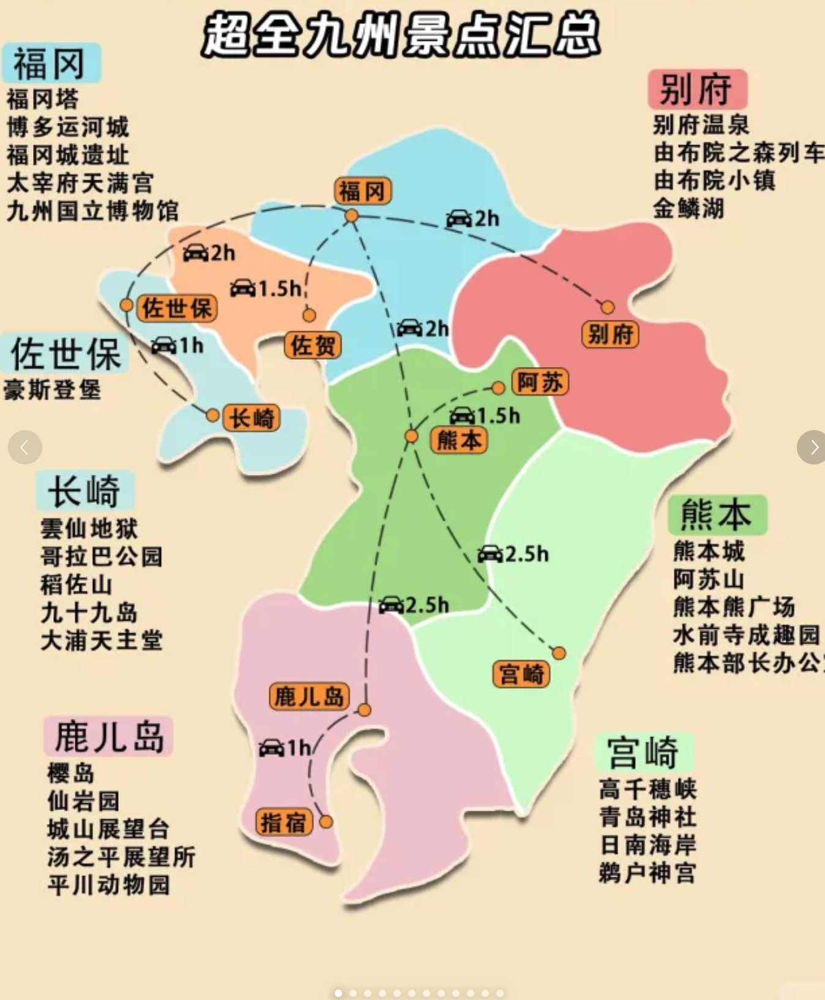

#### 日本九州旅遊

##### 路線

- 導航 - Google Map(比較推薦)
- 旅遊方式(自由行)
- 交通(日本交通相對比較貴), 建議如果是玩南九州可以選擇自駕會比較方便, 畢竟是鄉下地方, 但基本上交通都到的了(建議買 [JRPASS](https://www.xiaohongshu.com/explore/652d5253000000001d03953a) 全九州通票), 與綁定一張西瓜(Suica)卡到 apple wallet 可以搭乘當地電車與公車.
- 住宿可以參考 booking.com 或者攜程

###### 鹿兒島

* [桜島](https://www.kagoshima-yokanavi.jp/zh-TW/feature/sakurajima2)
* [仙岩園](https://www.senganen.jp/zh-hant/)
* 城山展望台
* 湯之平展望台
* 指宿(指宿玉手箱列車可以搭車看海景, 建議可以體驗, 可以用JRPASS畫位子)
* 美食: 可以到市區天文館附近商圈晃, 品嚐黑豚火鍋或烤肉
* 住宿: 可以住鹿兒島市區逛街購物方便
* 酒店: [Solaria Nishitetsu Hotel Kagoshima](https://www.booking.com/hotel/jp/solaria-nishitetsu-hotel-kagoshima.zh-tw.html?label=New_English_EN_AU_19670094265-SXf*g6yHRoMj1hrAxMlYRAS640819000779%3Apl%3Ata%3Ap1%3Ap2%3Aac%3Aap%3Aneg&sid=834aa18e589697f9add4fd361fc95eb0&aid=318615&ucfs=1&arphpl=1&checkin=2023-12-02&checkout=2023-12-03&dest_id=-231554&dest_type=city&group_adults=2&req_adults=2&no_rooms=1&group_children=0&req_children=0&hpos=1&hapos=1&sr_order=popularity&srpvid=a2bb3cae33bd006c&srepoch=1701506277&all_sr_blocks=39062607_86361371_0_2_0&highlighted_blocks=39062607_86361371_0_2_0&matching_block_id=39062607_86361371_0_2_0&sr_pri_blocks=39062607_86361371_0_2_0__3600000&from=searchresults#hotelTmpl)

###### 宮崎

* [日南海岸太陽宮花園](https://www.miyazaki-city.tourism.or.jp/zh_TW/see-and-do/10057)
* [青島神社](https://journey.tw/aoshima-shrine/)
* [鵜戶神宮](https://www.miyazaki-city.tourism.or.jp/zh_TW/see-and-do/10055)
* 美食: 可以品嚐宮崎和牛料理

**個人建議時間如果比較不足, 想體驗神社可以選擇其中一個, 推薦鵜戶神宮離日海岸近**

##### 熊本(有很多海賊王人物可以去打卡分布在九州各個地方)

* 熊本城(日本三大名城之一), 旁邊的商店街也別錯過比較有特色的小零食可以在這邊買
* [阿蘇(阿蘇火山)](https://stellaclife.com/aso-san-one-day-trip/)
* 晚上購物逛街: 建議住宿熊本城附近, 很多商店街可以逛
* 酒店: [Daiwa Roynet Hotel Kumamoto](https://www.booking.com/hotel/jp/daiwaroinetutohoteruxiong-ben-hua-tian-jia-cheng.zh-tw.html?aid=1475963&label=postbooking_confemail&sid=834aa18e589697f9add4fd361fc95eb0&all_sr_blocks=712150003_297654936_0_2_0;checkin=2023-12-02;checkout=2023-12-03;dest_id=-234757;dest_type=city;dist=0;group_adults=2;group_children=0;hapos=1;highlighted_blocks=712150003_297654936_0_2_0;hpos=1;matching_block_id=712150003_297654936_0_2_0;no_rooms=1;req_adults=2;req_children=0;room1=A%2CA;sb_price_type=total;sr_order=popularity;sr_pri_blocks=712150003_297654936_0_2_0__2100000;srepoch=1701506731;srpvid=af403d92756e0003;type=total;ucfs=1&#hotelTmpl)

###### 福岡

* 天神市區(購物逛街)
* 住宿: 博多
* 酒店: [八百冶博多酒店(Yaoji Hakata Hotel)](https://hk.trip.com/hotels/fukuoka-hotel-detail-705508/yaoji-hakata-hotel/)

###### 佐賀

* 奧特萊斯

